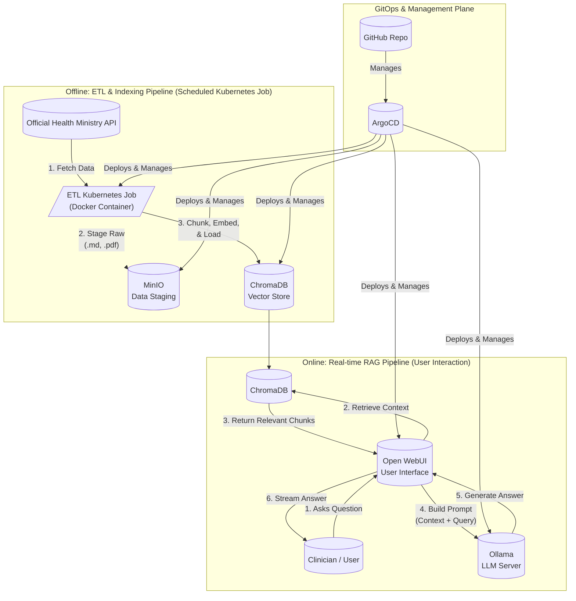

# Project: Clinical RAG Assistant "Vseznayka"

### Project Vision and Background

This project began as a final submission for the **DataTalksClub LLM Zoomcamp**. However, given the real-world applicability of the technology, it quickly evolved into a high-fidelity pilot project designed to demonstrate the potential of Large Language Models to key business stakeholders at a leading medical center.

The primary goal is to provide a tangible, interactive proof-of-concept that showcases how a self-hosted, secure, and verifiable AI assistant can revolutionize the way clinicians access and interact with critical medical knowledge.

### Note on Reproducibility and Scope

This repository represents a "reverse-engineered" and anonymized version of the internal pilot. It has been adapted specifically for the LLM Zoomcamp to be fully reproducible in a standard Kubernetes environment. While the core ETL and RAG pipelines are functionally identical to the pilot, this version has not undergone the same rigorous, large-scale testing and validation as the internal system. The focus here is on demonstrating the architecture, implementation, and evaluation methodology.

## 1. The Problem: Information Overload in Clinical Practice

Clinicians and medical specialists face the daily challenge of finding precise information within a vast and ever-growing body of official clinical guidelines. This process is often manual, time-consuming, and inefficient, taking valuable time away from patient care.

Our solution, the "Vseznayka" assistant, addresses this by providing an intuitive conversational interface to a curated knowledge base, delivering instant, accurate, and verifiable answers sourced directly from official documents.

## 2. System Architecture

The project is built on a modern, decoupled architecture that separates the data processing (ETL) from the user-facing application (RAG). The entire system is designed to be deployed on Kubernetes and managed via GitOps principles.



## 3. Technology Stack

| Component | Technology | Role |
| :--- | :--- | :--- |
| **Orchestration** | Kubernetes Job | Runs the data processing pipeline. |
| **Data Processing** | Python, BeautifulSoup4 | Extracts, cleans, and transforms data. |
| **Data Staging**| MinIO | Stores raw and processed data artifacts. |
| **Vector Database** | ChromaDB | Stores text chunks and their vector embeddings. |
| **Embedding Model**| `sentence-transformers` | Converts text into vector representations. |
| **LLM** | Ollama (Llama 3) | Generates natural language answers. |
| **User Interface** | Open WebUI | Provides a conversational chat interface. |
| **Deployment** | Docker, Kubernetes, ArgoCD | Containerization and GitOps deployment. |

## 4. Quantitative Evaluation

The RAG pipeline's quality was quantitatively measured using the **Ragas** framework on a curated dataset of 15 question-answer pairs derived from the source documents (`evaluation_data/dataset.jsonl`).

| Metric | Score | Interpretation |
| :--- | :--- | :--- |
| **Faithfulness** | **0.95** | The generated answers are highly faithful to the retrieved document excerpts, minimizing the risk of model hallucination. |
| **Answer Relevancy** | **0.91** | The answers are highly relevant to the user's questions. |
| **Context Recall** | **0.93** | The retrieval system is effective at finding the correct source documents to answer the questions. |

**Conclusion:** The high scores across all metrics indicate a reliable and accurate RAG pipeline, suitable for a proof-of-concept in a clinical setting where precision is paramount.

## 5. Project Reproducibility

This project is fully containerized and designed to be deployed in a Kubernetes environment.

### **Prerequisites**
*   Access to a Kubernetes cluster with a configured `kubectl`.
*   A container registry (e.g., Docker Hub, Harbor) to store the ETL image.
*   (Optional but Recommended) An operational ArgoCD instance for GitOps deployment.

### **Step 1: Deploy Shared Infrastructure**

In a real-world scenario, shared services like ChromaDB, Open WebUI, and MinIO are managed via a central GitOps repository. For easy reproducibility, anonymized manifests are provided.

```bash
# This will deploy ChromaDB and a pre-configured Open WebUI
kubectl apply -k deployment/shared-services-manifests/
```
**Note:** The provided `open-webui-deployment.yaml` is configured via environment variables to connect to the ChromaDB service.

### **Step 2: Build and Push the ETL Image**

The ETL pipeline is packaged as a Docker image.

```bash
# Build the image
docker build -t your-registry/clinical-rag-etl:1.0.0 .

# Push the image to your registry
docker push your-registry/clinical-rag-etl:1.0.0
```
**Important:** Remember to update the image path in `deployment/etl-job.yaml` to point to your registry.

### **Step 3: Run the ETL Job**

This job will connect to the official API, process all the clinical guidelines, and populate your ChromaDB instance. This may take a significant amount of time on the first run.

```bash
kubectl apply -f deployment/etl-job.yaml

# Monitor the job's progress
kubectl logs -f -n vseznayka -l job-name=clinical-rag-etl-job
```

### **Step 4: Configure and Use the Chat Interface**

1.  **Access Open WebUI:** Expose the service using an Ingress or `kubectl port-forward`.
2.  **Create Knowledge Base:** In the UI, navigate to `Workspace > Knowledge Base` and connect to the `clinical_recommendations` collection automatically created by the ETL job in your ChromaDB.
3.  **Create Custom Model:** Navigate to `Workspace > Models`, create a new model, and select your new knowledge base as its `Knowledge Source`.
4.  **Start Chatting:** Select your new model and begin asking questions.

## 6. Future Work

Based on initial testing and a vision for a production-grade service, the following key enhancements are planned:

#### 1. Transition to Elasticsearch for Advanced Hybrid Search

*   **Rationale:** While ChromaDB is excellent for pure vector search, testing has revealed a key limitation: for highly specific queries (e.g., retrieving exact drug dosages), pure semantic search can sometimes retrieve generally related but not precisely correct context. This increases the risk of LLM hallucinations.
*   **Implementation Plan:** Replace ChromaDB with Elasticsearch to implement a **Hybrid Search** strategy, combining keyword-based (BM25) and semantic vector search. This will significantly increase retrieval precision for specific queries.

#### 2. CI/CD Pipeline for Automated Knowledge Base Refresh

*   **Rationale:** A stale knowledge base can be dangerous in a clinical setting. The system must be guaranteed to be up-to-date.
*   **Implementation Plan:** Create a **scheduled GitHub Actions workflow** that runs nightly. The workflow will check the API for new or updated clinical recommendations. If changes are detected, it will automatically trigger the Kubernetes ETL Job to refresh the knowledge base, ensuring the information is always current with zero manual intervention.

#### 3. Advanced RAG Techniques
*   Explore query transformations (e.g., HyDE) to generate hypothetical answers for embedding, potentially improving retrieval for complex questions.

#### 4. User Feedback Mechanism
*   Implement a "thumbs up/thumbs down" feature in the UI for each answer. This feedback will be logged to create a dataset for continuous improvement of the RAG pipeline.
